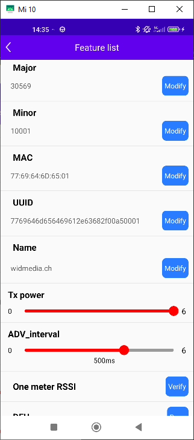

# Project documentation

Github project distance. This file contains some general documentation about the different parts of this project:
1. bluetooth transmitter: HolyIOT (beacon)
1. bluetooth receiver: Pico2W with micropython
1. display: standard LCD display from waveshare
1. casing: wooden block
1. website
1. (currently obsolete) android app

# TODO
1. casing: wooden casing not suitable for more than one or two devices  (styrofoam is easier to handle but not firm enough, edges are crumbling). 
   1. 3d printed casing for the future (haptic feeling of wooden brick however is luxurious though, on the other hand it's quite heavy and big)
   1. Better suited usb cables? (bend on micro-USB side?, short length, USB-C instead of USB-A connector (thinner)) [LinkA](https://fpvframe.ch/fpvx/product/usb-c-to-micro-usb-cable/ CHF10 (+5.- shipping))
1. website, project documentation, later on maybe also add e.g. kickstarter to promote the thing
1. how to sell it? Go for subscription (CHF 5 per month or CHF 60 per year), transfer the stuff to website. Once 1000 lanes are counted, a transfer is required (and denied for expired subscriptions). Requires another start screen and touchscreen accessibility. Also wireless connection to transmit the data and reset the 1000 lanes counter
1. Testing on 50m lane
1. github master to main:
"""
git branch -m master main
git fetch origin
git branch -u origin/main main
git remote set-head origin -a
"""


## Bluetooth-Beacon
using Holyiot Bluetooth-Beacons (aliexpress, ~CHF 8.-), do have a NRF52810 chip inside
* CR2032-Knopfzelle / Konfigurieren per App „Holyiot-Beacon“; Modi: Beacon / iBeacon / Eddystone
* Eddystone: Beacon URLs + Akkuspannung senden
* Sendeleistung von 0 bis 6 dBm (1 bis 4 Milliwatt), Sendeintervall zwischen 30 und 1000 ms (auf Sicht ~80 Meter Reichweite bei 1000 ms Intervall, 6 dBm Sendeleistung, Empfänger ESP32 mit IPEX-Anschluss und 2,4-GHz-Rundstrahler, Reichweite variiert stark mit Empfangsantenne)
* „Holyiot-Beacon“ app to configure is working
   * default password is AA14061112
   * config tx: 500 ms, txpower 6
   * config: beacon mode
      * name=widmedia.ch
      * uuid=7769 646d 6564 6961 2e63 682f 00a5 0001 (this means widmedia.ch/"00a5"&4_chars_number). major(5chars)=30569, minor=10001. MAC=77:69:64:6d:65:01
      * filter for the major number 30569.
      * factory settings for uuid/major/minor/MAC: fda50693a4e24fb1afcfc6eb07647825/10011/19641/E6:D9:29:7B:33:F1. UUID:32hex numbers 

#### orders
Aliexpress order on 20240903 (received 20240917):
                              hook? | waterproof? | bat incl.? | order id           | notes
--------------------------------------------------------------------------------------------
2 x nRF51822, 4.59, CR2477,      -  |       X     |     X      |                    | nRF51822 no BLE5.0 / Bat is bigger, 4xcapacity
3 x nRF52810, 5.32, CR2032,      X  |       -     |     -      |
5 x nRF52810, 6.60, CR2032,      X  |       -     |     -      | (same as old)


### Alternative
Nordic RF chips directly, program them on 'bare metal level'
nRF52840 Dongle / Taiyo Yuden: see documentation below. Both need C/C++ programming 


## Bluetooth-Receiver
Use a Pico2W, drawback of having only an internal BT antenna
* micropython not yet released for pico 2 w. Preliminary version v1.25.0-preview available [here] (https://www.raspberrypi.com/documentation/microcontrollers/micropython.html)
* aioble already installed
* [ble api](https://github.com/micropython/micropython-lib/tree/master/micropython/bluetooth/aioble)

### Alternative
ESP variants (not tried)
1. e.g. [Adafruit ESP32 Feather V2 w.FL Antenna](https://www.adafruit.com/product/5438). Does have external antenna, not too pricey --> 32$ per pc with shipping from US
1. e.g. TTGO-ESP32-PSRAM-Antenna-Bluetooth --> check details 
1. e.g. Geekcreit-ESP32-CAM-WiFi-bluetooth-Camera-Module-Development-Board-ESP32 --> check the one I have, does it have a connector?
1. e.g. LILYGO-TTGO-T8-V1_1-ESP32-4MB-PSRAM-TF-CARD-3D-ANTENNA
1. [feather form with internal antenna](https://www.heise.de/news/ePulse-Feather-ESP-C6-Zigbee-WiFi-BLE-Thread-und-Matter-9646111.html)
1. [seed studio for all wireless formats](https://www.heise.de/news/Seeed-Studio-XIAO-ESP32C6-Kleines-Board-fuer-Matter-Zigbee-und-vieles-9743884.html)

## Display
Standard LCD one: [waveshare, for pico](https://www.waveshare.com/pico-restouch-lcd-2.8.htm). 240x320px. Works nicely. 

### Alternative
1. 7segment: big ones require voltages of 7.x V. Need to select with lower voltages. Forward voltage is per chip (e.g. 2.0V). What does it mean? (4 LEDs per segment, 2 LEDs per DP)
   * [distrelec, 7.xV, 57mm, CHF 11.7](https://www.distrelec.ch/de/segment-led-anzeige-sa23-rot-57mm-655nm-45mcd-2v-tht-gemeinsame-anode-kingbright-sa23-12srwa/p/17511900)
   * [mouser, 3.9V, 25.4mm, CHF 4.-](https://www.mouser.ch/ProductDetail/Kingbright/SA10-21SYKWA?qs=FRBiz4Wv1YMB%252Bq%2FAgwsA4A%3D%3D)
   * [mouser, 7.xV, 122 mm, CHF 27.-](https://www.mouser.ch/ProductDetail/Kingbright/SA40-19SURKWA?qs=FRBiz4Wv1YNzfTxT3E0R9g%3D%3D) 
1. Fallblattanzeige / split flap display (search for splitflap) --> could reuse a clock. There seems to be no widely available solution to just buy, everybody does it themselves.
1. Nixie tube (clock kit): Nixieclocks.ch (sells one tube for 100.-) Need a replica, is available...
1. other links: 
   * https://www.hackster.io/GRA_AND_AFCH/nixie-display-or-clock-in-14-raspberry-pi-hat-ncs314-79a19b 
   * https://peppe8o.com/7-segment-display-and-raspberry-pi-pico-wiring-and-setup-with-micropython/
-> split flap preferred

## Casing
Currently going for a Holzklotz prototype for PicoW+Display, USB cable and power bank
1. Might need to add a switch?
1. Add screws to fixate plexi glass cover
1. [CHF 17.60 for both parts](https://www.drei-de.ch/online3ddruck.html) or [international offers](https://craftcloud3d.com) -> trial with craftcloud

## 3d Tool
1. Blender is complicated but can/(should-be-able-to) do everything
1. Checking out autodesk fusion (Zscaler issue)
1. ~~Tinkercad seems like a colorful toy for teachers, not really useful~~
1. Microsoft 3D Builder: ...to be checked... (somewhat cannot be installed on wlap)


### Alternative
(not tried out)
* casing for PicoW + Waveshare 2.8 display:
   * https://www.thingiverse.com/thing:6128955 (just display, no bttrPck...) -> looks good, two parts. Need to adapt it for the power bank
   * https://www.printables.com/de/model/746392-waveshare-dsi-28in-screen-case-for-ender-3-v3-se/related   


## Website
Currently at [widmedia.ch/schwimmmesser](https://widmedia.ch/schwimmmesser)


## SwimMeter App
using [altbeacon](https://github.com/davidgyoung/android-beacon-library) and adapted their reference app. Previously have been using [simple ble scanner](https://github.com/lorenzofelletti/SimpleBleScanner)
official [altbeacon](https://github.com/AltBeacon/android-beacon-library) is much younger than the davidyoung part. Need to rely on that one?
   1. need to get rid of background location access. Possible to still use altbeacon? -> https://github.com/agap/luch has about the same interest (only foreground)


1. implemented features
   1. searches for beacons, lists them (including rssi, moving average distance estimation)
   1. logs the entries to an internal file and exports this to downloads folder
1. features to be implemented
   1. (later) analyze the distance values
1. Notes (graphics stuff)
   * icon/icon-foreground sizes(192-432/144-324/96-216/72-162/48-108)
   * colors: blue is 0x2314C2, yellow is 0xE5B72A
   * GooglePlay logo: 512, feature graphic: 1024x500. Screenshots in correct language (phone + tablet)
1. got it back into the app store: 
   * removed background location access
   * version 47, API ok (34)


## Older Stuff...
### nRF52840 Dongle
(newer to older)

1. eddystone example requires micro-ecc. To do that: run SDK16\external\micro-ecc\build_all.bat
   1. need [make](https://sourceforge.net/projects/gnuwin32/) for that: C:\Program Files (x86)\GnuWin32\bin
   1. need to get [GNU Tools ARM Embedded](https://developer.arm.com/tools-and-software/open-source-software/developer-tools/gnu-toolchain/gnu-rm/downloads) and specify (e.g. 9 2019-q4-major, version=9.2.1) in SDK16\components\toolchain\gcc\Makefile.windows
   1. (or use compiled version which I added to repository)
1. eddystone seems to be the right example: transmit URL working, no device name though (not supported by non-connectable beacons like eddystone) (widmedia.ch = 77 69 64 6D 65 64 69 61 2E 63 68)
1. ble beacon with a device name is working as well: ble_app_beacon.zip
1. ble beacon is working as well: nRF5SDK16\ ...\ble_app_beacon\pca10056_adapted59\s140\ses.
1. ble advertise for the 10059 is working: use the adapted file (origin was 10056) for the 10059 code. Can connect to it as well.
1. ble advertise is working (active infinite, survives power cycle, widmediaDistance, between -60 and -70 dBm). Needs:
   * nRF5SDK15\components\softdevice\s132\hex\s132_nrf52_6.0.0_softdevice.hex
   * nRF5SDK15\examples\ble_peripheral\nrf52-ble-tutorial-advertising\pca10040\s132 -> (adapted main.c) DeviceName = WidmediaDistance. Can connect to it...
   * did not do any board adaptions

### nRF52 DK

1. build example project: C:\Nordic\SDK\nRF5SDK16\examples\ble_peripheral\ble_app_uart\pca10040\s132\ses
1. ble advertise my own data: advertising name is now WidmediaDistance. Using [ble advertising tutorial](https://devzone.nordicsemi.com/nordic/short-range-guides/b/bluetooth-low-energy/posts/ble-advertising-a-beginners-tutorial), for pca10040, requires the SoftDevice S132 with SDK version 15.0. Does survive a power cycle.
1. blinky: working fine: examples\peripheral\blinky\hex, copy to jlink folder

### EBSLCNZWW TY

1. debugger connection with J-link edu ok

### Webpage

* [https://widmedia.ch/swimmeter](https://widmedia.ch/swimmeter) is the main page. /swim and /SwimMeter are forwarding to it.
* logging display is on [swimmeter/logging/](https://widmedia.ch/swimmeter/logging/)
* RSSI-vs.-Time graph tool is extracted from pChart2.0-for-PHP7

## TODO

1. app
   1. logging to file/ram, then send the whole array of logdata as JSON object (instead of single logs)
   1. reduce imports (don't understand most of it). Already done:
      1. Firebase/Crashlytics
      1. junit
   1. data privacy text
1. website
   1. (maybe) improve logging graph display
1. beacon
   1. adapt / understand eddystone example more -> adapt to taiyo yuden, have board definition there
      1. timers_init(): sets up RTC and IRQ priorities. Doesn't seem like much application specific
      1. leds_init(): bsp_init (bsp = board support package?), does buttons and LEDs stuff, depending on board specifics. app_button_init / app_button_enable / app_timer_create. So, init, enable idn timer buttons and some LED.
      1. button_init(): init and enable buttons are activated.
      1. scheduler_init(): allocates a buffer, related to SCHED_MAX_EVENT_DATA_SIZE / SCHED_QUEUE_SIZE. Not fully clear which different tasks are scheduled.
      1. power_management_init(): unclear (apart from the self-explanatory function name)
      1. ble_stack_init(): sets up number of connections, what roles (peripheral or whatnot), does register a handler for BLE events.
      1. TODO. gap_params_init(): will set up all the necessary GAP (Generic Access Profile) parameters of the device and sets the permissions and appearance. Probably the part to adapt, e.g. sets the device name (SwimCounter). Uses values defined in es_app_config.h.
      1. gatt_init(): GATT = generic attribute profile, specifies the structure in which profile data is exchanged. Seems like it's not intended to be configurable.
      1. conn_params_init(): update delays and update counts are configured here.
      1. TODO. nrf_ble_es_init(on_es_evt): argument is the function handler (or address of the function defined in the same file). Sets up security stuff and lot more, es_event here seems like 'big' events, like connectable_started, connectable_stopped.
      1. for(ever) loop idle_state_handle(): call event handler and pwr management. Makes sense.
         1. app_sched_execute(): processes the event queue one after the other while not empty
         1. nrf_pwr_mgmt_run(): waiting for an event from the softdevice. Does some power management stuff like sleep, runs cpu usage monitors.
   1. distance 'calibration' (change the value at 0m): measure the power at 1m, add 41 dBm to this value. The value is a signed 8 bit integer (0x12 is interpreted as +18dBm, 0xEE is interpreted as -18dBm). --> changing APP_CFG_DEFAULT_RADIO_TX_POWER value does not help. Try with the app, on a more recent android.
   1. nRF beacon for Eddystone does not work on the S6 (Error 22). Did work once though, on the Huawei maybe?
1. filed trial: waterproof setup
1. get the taiyo yuden running (see [adaptions](#Taiyo-Yuden-adaptions) )
   need the s112? Maybe nRF5SDK16\ble_app_beacon\pca10056e\s112\ses or nRF5SDK**15**\nrf52-ble-tutorial-advertising\pca10040e\s112\ses

## Done

1. website
   1. implement json endpoint (like webhook.site) and display the stuff
1. app stuff
   1. implement some functionality
   1. tablet screenshot
   1. test translate stuff, second language (de)
   1. start with [beacon scanner](https://github.com/Bridouille/android-beacon-scanner) (previous alternative: [github BLE library](https://github.com/alt236/Bluetooth-LE-Library---Android) ).
   1. googlePlay: description in DE (auto-translated otherwise)
   1. icon/icon-foreground (192-432/144-324/96-216/72-162/48-108). GooglePlay logo: 512
   1. remove any warnings on the beacon scanner app (one remaining, guess I can ignore it)
   1. install my own app (app review is pending...)
   1. use the most current version of all the plugins. 4 NOK are still remaining: logging/converter-gson/retrofit/adapter-rxjava. Most probably will leave it at this.
   1. (can still improve more): logo (512x512), 2 screenshots (mobile), 'feature graphic' (1024x500). Different graphics tool than visio
   1. publish the stuff: quite a pita
   1. Now: sync ok, gradle build ok, run ok on mobile (and on simulator but bluetooth is difficult) with the various workarounds depicted in the word document (check again whether all of them are necessary). Can change some strings, show up in App. So, hello world is done...
   1. Do a clean setup @PC.
1. will not do: ~~adapt windows beacon display. Should display nothing, if type is not eddystone. Have to change only the output, not the beacon class or whatnot.~~
   * +Better setup / -Will not be used in the end / +Will learn about BLE etc. / +Better setup compared to Android studio (which cannot run on simulator, for bluetooth access I guess)
1. documentation. The github md file?
1. not doing it, working with other examples: ~~port the ble-tutorial-advertising to SDK16. Understand the code of this example~~
1. field trial: acquire some rssi data. As a first trial, just pack everything into my swimming bag.
1. [nRF command line tools](https://www.nordicsemi.com/Software-and-Tools/Development-Tools/nRF-Command-Line-Tools/Download#infotabs)
1. laptop: segger license (hooked to bluetooth connection, not ideal)
1. Mobile (Galaxy S6) apparently only has bluetooth 4.1. should be enough though to receive any beacon variety
1. widmedia.ch/swim page. (SwimMeter, swimmeter, swim-meter etc)... must not be more than 17chars: . /swim is the main page, others just forwardings. SwimMeter however shall be the main name
1. eddystone logging app. With logging to file: beacon scanner
1. beacon display on PC: [beacon interactor: works, displays stuff](https://www.andreasjakl.com/bluetooth-beacon-interactor-2-for-windows-10/)
1. reliable logging setup: beacon scanner is working with non-modified beacon as well (just the programmed URL slot). Distance and RSSI are closely related but not exactly the same

## Beacon HW

Nordicsemi devkit: CHF 68 at [Farnell](https://ch.farnell.com/nordic-semiconductor/nrf52840-dk/dev-kit-bluetooth-low-energy-soc/dp/2842321?ost=NRF52840-DK&ddkey=https%3Ade-CH%2FElement14_Switzerland%2Fsearch) , contains a nordicsemi module. [SDK](https://infocenter.nordicsemi.com/topic/com.nordic.infocenter.sdk5.v15.3.0/nrf52810_user_guide.html)

### Purchased

1. [nRF52840 Dongle](https://www.nordicsemi.com/Software-and-Tools/Development-Kits/nRF52840-Dongle): USB connection, small and simple, 10$.
1. [nRF52 DK](https://www.nordicsemi.com/Software-and-Tools/Development-Kits/nRF52-DK): standard dev kit. 40$. ¿The one nordicsemi dev kit can only emulate the 'direction' feature?
1. Eval kit: EBSLCNZWW, contains a EYSLCNZWW module
1. Module: EYSLCNZWW, this contains a nRF52810 (192kB Flash, 24kB RAM).
   * NordicSemi nRF52810 does not have advertising capacity and no long-range support.

## Building the Project

[getting started pdf](https://infocenter.nordicsemi.com/pdf/getting_started_ses.pdf)

* SDK at c:\Nordic\SDK\nRF5SDK16\

## Other Docu

 <!--- ## Nordicsemi Code --->

### Taiyo Yuden adaptions

example code about the 32 kHz crystal osc: page 27 in [NZWW data report](https://www.yuden.co.jp/wireless_module/document/datareport2/en/TY_BLE_EYSLSNZWW_DataReport_V1_0_20190227E.pdf)
_From FQA: each BLE module has an internal 32MHz crystal. Please note, Nordic's nRF51DK (evaluation board) and nRF51 sample applications included in SDK are designed to run on a 16MHz clock. Since TAIYO YUDEN modules run on a 32MHz clock, Nordic's nRF51 sample applications will need some modification in order for it to work on TAIYO YUDEN modules._

_To fix this issue, we need to write the value 0xFFFFFF00 to the UICR (User Information Configuration Register) at address 0x10001008. Please note that the UICR is erased whenever you download a SoftDevice._

_The UICR can be written by using the debug tools:
nrfjprog.exe --snr <your_jlink_debugger_serial_number> --memwr 0x10001008 --val 0xFFFFFF00_

_Or the following code can be added to the SystemInit function in the system_nRF51.c file, right before launching the TASK_HFCLKSTART task:_

```c
if (*(uint32_t *)0x10001008 == 0xFFFFFFFF)  
{
    NRF_NVMC->CONFIG = NVMC_CONFIG_WEN_Wen << NVMC_CONFIG_WEN_Pos;  
    while (NRF_NVMC->READY == NVMC_READY_READY_Busy){}  
    *(uint32_t *)0x10001008 = 0xFFFFFF00;  
    NRF_NVMC->CONFIG = NVMC_CONFIG_WEN_Ren << NVMC_CONFIG_WEN_Pos;  
    while (NRF_NVMC->READY == NVMC_READY_READY_Busy){}
    NVIC_SystemReset();  
    while (true){}  
}  
```

Defines are available in the sdk_config.h. Also I guess I need the S112 soft device [see here](https://devzone.nordicsemi.com/f/nordic-q-a/39981/nrf52810-taiyo-yuden-eyslcnzww-problem-with-nrfgo-studio). Flush that one nRFGo?

### Development Software

[flasher / SDK / HowToStart: all in one](https://www.nordicsemi.com/Software-and-Tools/Development-Tools/nRF-Connect-for-desktop/Download#infotabs)

## Mobile side

1. nRF Connect app for trials

---

## Outdated

### Technology

1. iBeacon
1. Eddystone: same area, further development
1. Ultrawideband uwb
1. Magnet on the swimmer, electronic compass as detector
   * Drawback: cannot distinguish several swimmers
   * nice and easy solution. However: technically not that interesting

### Receiver

1. Bluetooth beacon: mobile/tablet will serve fine, whatever microcontroller system should as well (either on board or with bluetooth expansion)
--> will order the blueup thing

### Beacon

#### Beacon Providers

1. [beaconstac](https://www.beaconstac.com/buy-beacons/) 3 pieces for 69$, either USB or keychain or small stationary
1. [bluebeacon](https://blueup.myshopify.com/products/bluebeacon-tag) 1 piece for 20€ (+39€ shipping, also when ordering 40€ goods), either USB or keychain
1. [beaconzone](https://www.beaconzone.co.uk/usb-beacons) 1 piece for 18.6 £ (cannot buy one piece only)
1. [amazon](https://www.amazon.de/DSD-TECH-SH-A11-Bluetooth-Technologie/) do not send to CH
1. [amazon](https://www.amazon.de/JINOU-Bluetooth-Programmierbarer-staubdichtem-wasserdichtem-Unterst%C3%BCtzung) do not send to CH
1. [distrelec](https://www.distrelec.ch/de/bluetooth-modul-pan1740-panasonic) bluetooth module. Could maybe work?
1. [beaconshop24](https://www.beaconshop24.de) liefert nicht in die Schweiz

Seems to be a real problem to get the stuff into CH. Either: work around that with a lieferadresse-deutschland and hope that doesn't lead to issues or check with alibaba

#### Selected Device

[Document overview](https://www.yuden.co.jp/or/product/category/module/EYSLCNZWW.html)
[Family overview](https://www.yuden.co.jp/wireless_module/document/overview/TY_BLE_Overview_V1_8_20180530.pdf) | [Digikey link](https://www.digikey.ch/products/de?keywords=EBSLCNZWW) | [data report, not very useful](https://www.yuden.co.jp/wireless_module/document/datareport2/en/TY_BLE_EYSLCNZWW_DataReport_V1_0_20180530E.pdf)
