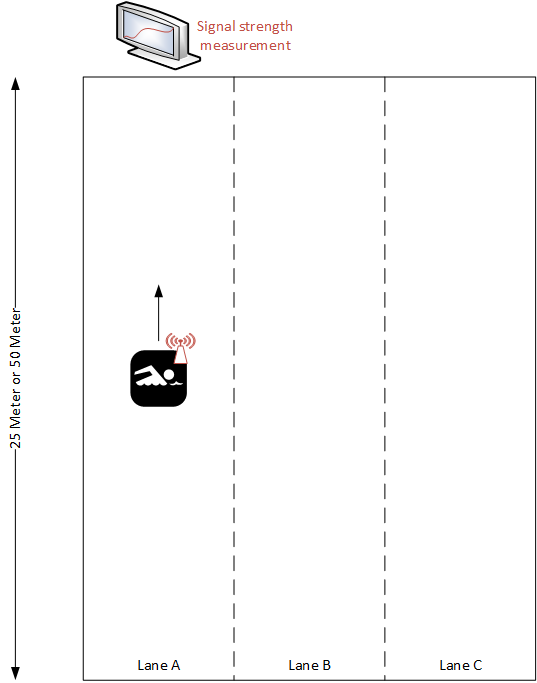

# Swimming Distance

Swim lane counter using bluetooth low energy distance measurement

(in a very early stage. No working prototype available yet)

## The Problem

I like to swim and I don't like to count the lanes. Because it's mindless and distracting and I always get it wrong...

## The Solution

Use technology to do that mindless task.

## How it works (hopefully at some time in the future)

Use a bluetooth low energy beacon (eddystone) attached to e.g. your swimming goggles because it's light and works for years on a small battery. Have a bluetooth detector at the edge of the pool displaying your counted lanes. To detect those it checks whether the signal is getting stronger (you are swimming towards it) or weaker (you're swimming away). A change from 'stronger' to 'weaker' results in an increase of the swimming lane counter. Voilà. Ok, some strong filtering is required on the beacon signal as this will sometimes be below water etc.

I don't want to use a (sports) watch as I don't want anything on my hands or wrists when swimming.
